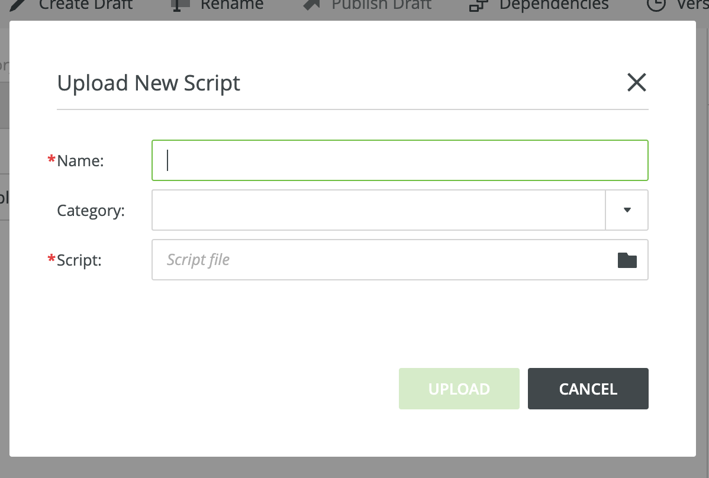
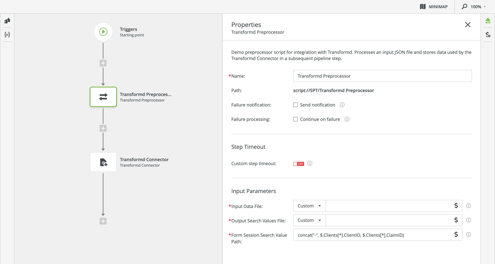

# Transformd Demo Preprocessor


## Overview

A demo pipeline script for use with the
[Quadient Inspire Evolve](https://www.quadient.com/en/customer-communications/inspire-evolve)
and the Generate service. This component is part of a larger demonstration
showing the integration of Quadient's Software-as-a-Service (SaaS)-based
customer communication solution (Evolve) and the [Transformd](https://transformd.com/)
platform for creating personalized customer experiences through forms and
workflow automation.

## Getting Started

### Prerequisites

In order to build and use the preprocessor, the following software must be
installed:

- [NodeJS](https://nodejs.org)
- [npm](https://npmjs.com)
- [Bobril build](https://www.npmjs.com/package/bobril-build)
- [Swarm](https://www.npmjs.com/package/@quadient/swarm) (optional)

### Build and Use

To build the script component, clone this repository:

```bash
git clone https://github.com/robertwtucker/transformd-demo-preprocessor.git
```

Run `Bobril build` to generate the `dist/a.js` file:

```bash
cd transformd-demo-preprocessor
npm run build
```

Open the **Generate** service UI and select the _Scripting_ section under the
_Content Manager_ tab. Click the _Upload New_ button to open the Upload New
Script dialog. Fill out the _Name_ and _Category_ fields. For the _Script_
field, browse to the `dist/a.js` file in the project directory.



As an alternative, if `swarm` is installed and configured (beyond the scope
of this document), you can automate the process in the terminal:

```bash
npm run script-upload
```

To create a pipeline, select the _Processing Pipelines_ section under the
_Design_ tab. Click the _New_ button to create a pipeline. Click the `{js}`
(_Custom Modules_) button on the left panel and drag the \_Transformd Preprocessor
script over to the pipeline. It should precede a
[Transformd Connector](https://github.com/robertwtucker/transformd-demo-connector)
step. Complete the properties section as pictured below.



## Roadmap

See the [open issues](https://github.com/robertwtucker/transformd-demo-preprocessor/issues) for a list of proposed features (and known issues).

## Contributing

Contributions are what make the open source community such an amazing place to learn, inspire, and create. Any contributions you make are greatly appreciated.

1. Fork the Project
2. Create your Feature Branch (`git checkout -b feature/AmazingFeature`)
3. Commit your Changes (`git commit -m 'Add some AmazingFeature'`)
4. Push to the Branch (`git push origin feature/AmazingFeature`)
5. Open a Pull Request

## License

Copyright (c) 2023 Quadient Group AG and distributed under the MIT License. See `LICENSE` for more information.

## Contact

Robert Tucker - [@robertwtucker](https://twitter.com/robertwtucker)

Project Link: [https://github.com/robertwtucker/transformd-demo-preprocessor](https://github.com/robertwtucker/transformd-demo-preprocessor)
